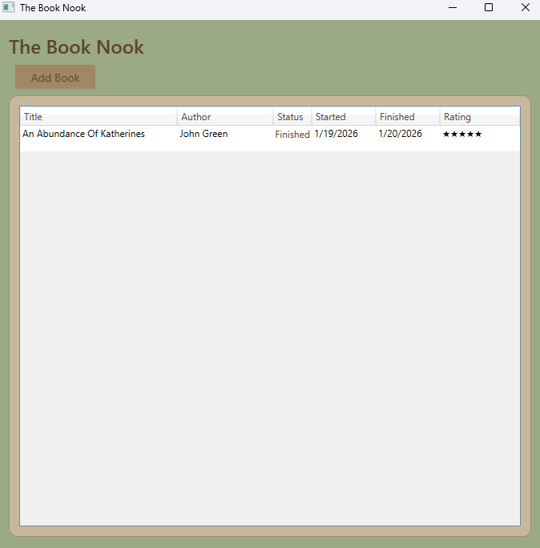
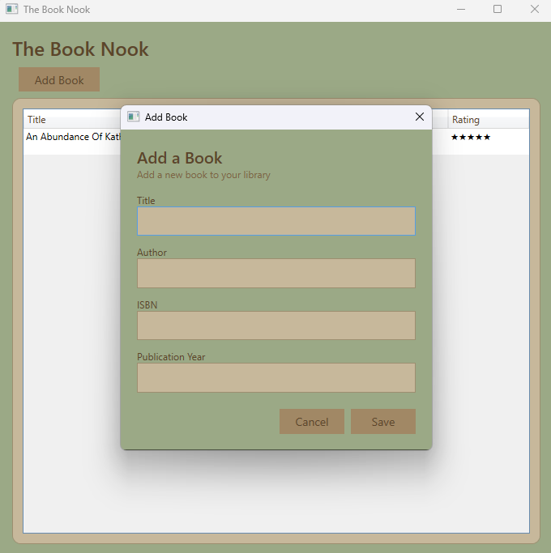
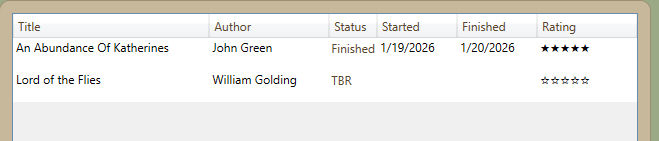
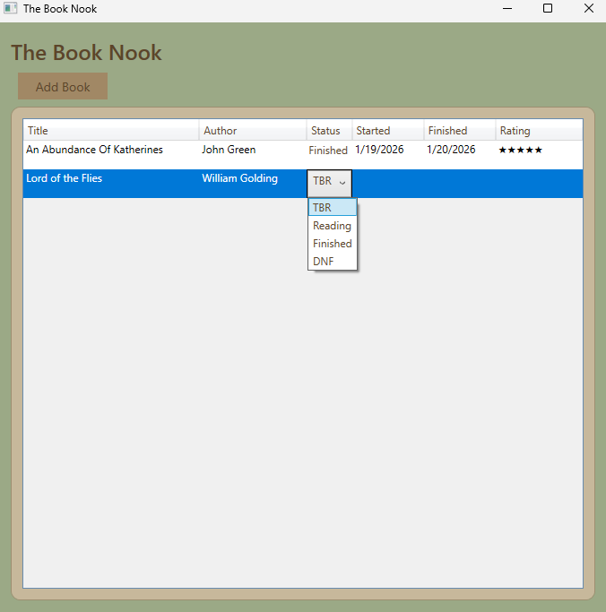
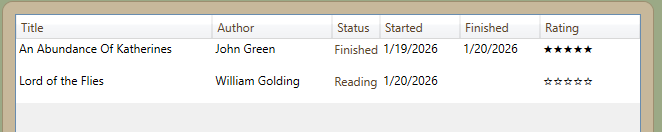

# The Book Nook
A personal library tracker built with .NET 10 WPF and EF Core.

_The main dashboard showing books and their reading status._

## Overview
The Book Nook is a windows desktop applciation built to help users track their books. Users can add books, update their reading status (TBR, Reading, Finished, DNF), record start and finish dates, and submit ratings.

This project was built to practice Entity Framework Core and SQL Server in .NET 10.

## Features
- Add, edit, and delete books
- Track reading status with automatic TBR defaults
- Record Date Started and Date Finished
- Rate books upon finishing
- Edit books through a dedicated Edit Book window
- Cozy UI theme using sage green, tans, and browns.

## Screenshots
### Add Book Window

### When a book is first added

### Reading Status Dropdown

### When status is set to 'Reading'

### Submit rating

### Edit Book Window

## Technology Stack

- **.NET 10 WPF** for the desktop UI
- **Entity Framework Core 10** for data access
- **SQL Server LocalDB** for local database storage
- **C#** for app logic

## Future Additions
- Sorting and Filtering
- Search
- Progress tracking

